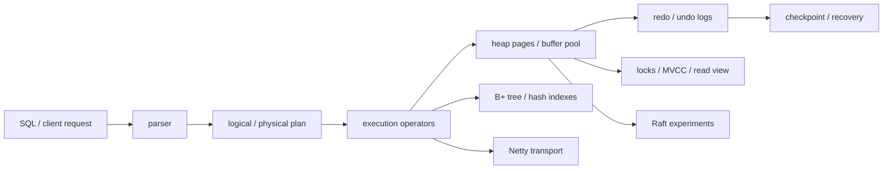

# happydb

[](https://github.com/happysnaker/happydb/stargazers)
[](https://happysnaker.github.io/happydb/)
[](https://happysnaker.github.io/support/#from-happydb)
[](https://happysnaker.github.io/review/)

`happydb` is a learning-oriented **relational database implementation in Java**
that explores storage engines, indexing, transactions, recovery, query
execution, query optimization, and basic replication ideas in one repository.

It is not a production database. It is a systems project built to understand
how the pieces of a small database fit together end to end.

- Project page: [happysnaker.github.io/happydb](https://happysnaker.github.io/happydb/)
- Proof before payment: [support/#proof-before-payment](https://happysnaker.github.io/support/#proof-before-payment)
- 10-second support router: [support/#sponsor-router](https://happysnaker.github.io/support/#sponsor-router)
- Sponsor prospect pipeline: [docs/sponsor-prospect-pipeline.md](https://github.com/happysnaker/happysnaker/blob/master/docs/sponsor-prospect-pipeline.md) — route database-internals / systems-project customers to the right proof, CTA, support note, and guardrail before paying or asking for review
- Good fit for: database internals study, systems-project portfolios, storage / transaction / optimizer interviews

## What this project covers

- heap-file storage and page management
- B+ tree and hash indexes
- row-level locking and MVCC-style visibility
- redo / undo logging and recovery
- simple SQL parsing and execution
- join / aggregate / filter / order-by operators
- cost-based query optimization experiments
- Raft-based replication experiments
- Netty-based client/server transport

## Highlights

- **Storage layer** with page abstractions, buffer-pool logic, heap pages, and
  table metadata management
- **Index layer** with both **B+ tree** and **hash index** implementations
- **Transaction path** with row-level locking, deadlock-related coordination,
  undo-log chains, and visibility handling
- **Recovery path** with redo / undo logs, checkpoints, and crash-recovery
  support
- **Execution engine** supporting filtering, joins, grouping, sorting, and
  scan operators
- **Optimizer experiments** using histograms and simple cost/cardinality
  estimation
- **Replication experiments** around Raft-style log replication and leader /
  follower roles

## Repository layout

```text
src/main/java/happydb/common/        bytes, files, catalog, shared utilities
src/main/java/happydb/storage/       records, pages, heap files, buffer pool
src/main/java/happydb/index/         B+ tree and hash index implementations
src/main/java/happydb/log/           redo / undo logging and recovery
src/main/java/happydb/transaction/   locks, transactions, read views
src/main/java/happydb/parser/        SQL parsing
src/main/java/happydb/execution/     query operators and executor
src/main/java/happydb/optimizer/     histogram + join-plan experiments
src/main/java/happydb/replication/   Raft-style replication experiments
src/main/java/happydb/transport/     Netty-based client/server transport
src/test/java/happydb/               unit and subsystem tests
docs/                                implementation notes and lab writeups
```

## Architecture at a glance



## Interesting implementation areas

If you are skimming this repository as a portfolio / systems project, a good
reading order is:

1. `storage/` — page, record, and buffer-pool foundations
2. `index/btree/` and `index/hash/` — index implementations
3. `transaction/` and `log/` — concurrency control and recovery mechanics
4. `execution/` and `optimizer/` — query operators and planning
5. `replication/` — replication and fault-tolerance experiments

## Status and tradeoffs

This is a **serious learning project**, not a hardened production database.

Known tradeoffs / limitations include:

- index-page logging and recovery semantics are simplified
- some SQL and locking scenarios are intentionally incomplete
- `FOR UPDATE` / next-key-locking style behavior is not fully implemented
- replication and operational hardening are exploratory rather than complete
- some performance claims come from development-time experiments, not a formal
  benchmark suite

That said, the repository still demonstrates real implementation depth across
database internals, concurrency control, logging, and systems design.

## Setup

- JDK: **19** (per current Maven compiler settings)
- Build tool: **Maven**

Open the repository in IntelliJ IDEA or another Java IDE with Maven support.

## Notes

This repository was influenced in part by database systems coursework such as
MIT 6.830 / SimpleDB-style exercises, but the implementation structure,
extensions, and combined feature set here go beyond a straight course skeleton.

For deeper implementation notes, see:

- [`docs/abc.md`](./docs/abc.md)
- [`docs/lab1.md`](./docs/lab1.md)
- [`docs/lab2.md`](./docs/lab2.md)
- [`docs/lab3.md`](./docs/lab3.md)
- [`docs/lab4.md`](./docs/lab4.md)
- [`docs/lab5.md`](./docs/lab5.md)
- [`docs/lab6.md`](./docs/lab6.md)

## Related repos

- [`CSAPPLabsAndNotes`](https://github.com/happysnaker/CSAPPLabsAndNotes) — systems-learning notes and CS:APP walkthroughs
- [`go-service-starter`](https://github.com/happysnaker/go-service-starter) — minimal production-minded Go HTTP service starter
- [`system-design-checklist`](https://github.com/happysnaker/system-design-checklist) — practical checklist and answer sheet for architecture reviews and distributed-systems tradeoffs

## Support

If this repo helped your database-internals learning, systems interview prep,
or implementation work:

- give it a star
- share it with other learners working on storage / database fundamentals
- support ongoing maintenance via the [support page](https://happysnaker.github.io/support/#from-happydb)
- current cross-project sponsor brief: [Sponsor one-pager](https://github.com/happysnaker/happysnaker/releases/tag/v2026.07-sponsor-one-pager)
- sponsor / paid-support intake replies: [share-kit intake replies](https://github.com/happysnaker/happysnaker/blob/master/docs/share-kit.md#sponsor--paid-support-intake-replies)
- deploy-read sample before paying: [happysnaker.github.io/review/deploy-read-sample](https://happysnaker.github.io/review/deploy-read-sample/)
- shortest support thread: [If happydb helped, here is the shortest support path](https://github.com/happysnaker/happydb/discussions/1)
- if this project saved you meaningful study time, a small direct tip such as
  `¥19.9` / `¥49.9` is already helpful
- if you want compact async feedback on your GitHub profile, repo README, or
  portfolio packaging, route the ask through the sponsor prospect pipeline first: https://github.com/happysnaker/happysnaker/blob/master/docs/sponsor-prospect-pipeline.md
- if you want compact async feedback on your GitHub profile, repo README, or
  portfolio packaging, I also offer a lightweight `¥99` async review on the
  support page
- public issue privacy guardrail: do not paste private logs, credentials, QR codes,
  payment screenshots, internal URLs, or raw live integration output in public issues;
  use the intake replies first

## License

MIT
